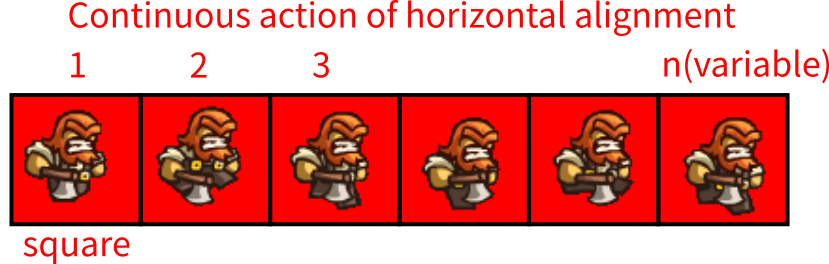

# gs-animate
gnome shell extension animate

You can self define your own png to replace with those 4 png files locate at `~/.local/share/gnome-shell/extensions/animate@eexpss.gmail.com/img`.

If you have funny character png, I glad to add into the extension.
